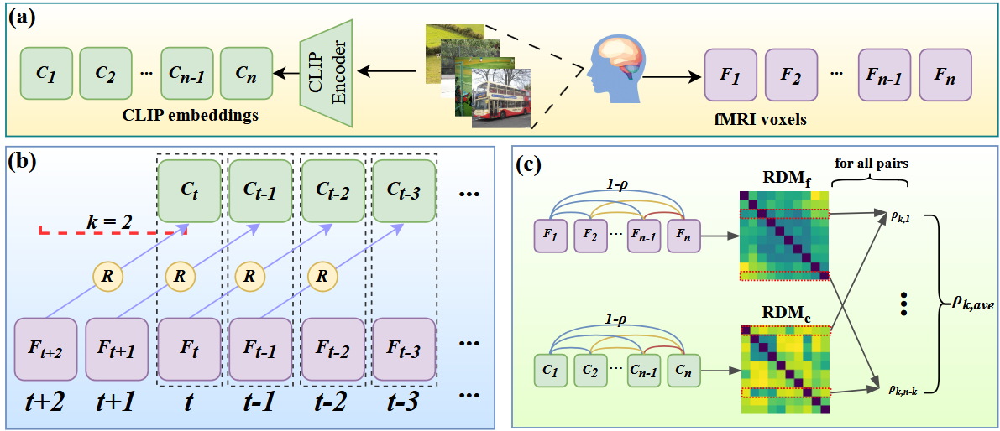

# Decoding the Echoes of Vision from fMRI: Memory Disentangling for Past Semantic Information

[](https://arxiv.org/abs/2409.20428)

## Overview
This repository contains the code and resources for the paper **"Decoding the Echoes of Vision from fMRI: Memory Disentangling for Past Semantic Information"**.



## Data Preparation
1. Download the required datasets from the NSD repository:
   - `nsddata`
   - `nsddata_betas`
   - `nsddata_stimuli`

## Analysis
Run the following scripts for preliminary analysis:
- `ridge.py`: Performs ridge regression analysis.
- `timewise_ana.py`: Conducts time-wise semantic analysis.

## Main Experiments
1. **Straightforward Method**
   - Train the model using `zerobase_train.py`.

2. **Disentangling Method**
   - Train the model with memory disentangling using `alltrain.py`.

3. **Caption Generation**
   - Use the CLIPCap model to generate captions by running `clipcap_gen.py`.

4. **Evaluation**
   - Evaluate the generated captions with the NLG-Eval toolkit by executing `nlg_eval.py`.

## Embeddings for Validation
To obtain disentangled embeddings for use in other experiments:
- Run `get_disembedding.py` to extract and save the embeddings.

## Acknowledgments

We sincerely thank the authors of the NSD dataset and the developers of CLIPCap and NLG-Eval for their foundational contributions, which significantly supported this research.
Our codebase builds on these repositories. We would like to thank the authors. 
> https://github.com/tknapen/nsd_access
## Citation
If you find this work helpful, please consider citing:
```bibtex
@inproceedings{xia2024decoding,
  title={Decoding the Echoes of Vision from fMRI: Memory Disentangling for Past Semantic Information},
  author={Xia, Runze and Yin, Congchi and Li, Piji},
  booktitle={Proceedings of the 2024 Conference on Empirical Methods in Natural Language Processing},
  pages={2040--2052},
  year={2024}
}


